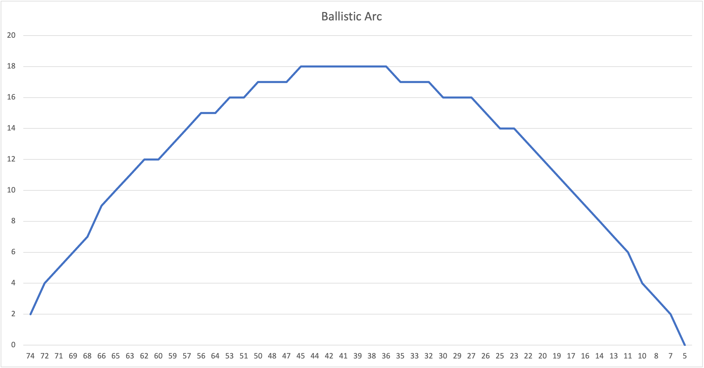

# Text Tanks

A simplification of a famous video game which has gone by many names. Here is a picture of "Tank Wars":


The idea is that two tanks take turns firing at each other. Shots follow ballistic arcs. Damage or death happens if a shot lands near or on the opposing tank.

## Simplifications

* The terrain is completely flat. There are no obstacles and the height of the floor has value 0.

* There are no graphics - just text.

* All shots are fired at an elevation of 45 degrees. The user can vary only the power behind the shot.

## Sample Game

Most of this specification's length is due to this section despite it being nothing more than a sample of the output of the game.

```text
Louie Position:   6 Health:  10 --- Ralph Position:  75 Health:  10
Tank: Louie Command (M, F, Q): 
```

There are 100 spots on the land ranging from 0 to 99 inclusive. *Louie* (the left tank) is sitting at position 6 and has full health. *Ralph* is sitting at position 75 and has full health.

```text
Tank: Louie Command (M, F, Q): f
Power (1 to 15): 8
[  7   2]  [  9   4]  [ 10   5]  [ 12   6]  [ 13   7]  [ 14   8]  [ 16   9]  [ 17  10]  
[ 19  11]  [ 20  12]  [ 22  12]  [ 23  13]  [ 24  14]  [ 26  14]  [ 27  15]  [ 29  15]  
[ 30  15]  [ 31  16]  [ 33  16]  [ 34  16]  [ 36  16]  [ 37  16]  [ 39  16]  [ 40  16]  
[ 41  16]  [ 43  16]  [ 44  16]  [ 46  15]  [ 47  15]  [ 48  14]  [ 50  14]  [ 51  13]  
[ 53  13]  [ 54  12]  [ 55  11]  [ 57  10]  [ 58   9]  [ 60   8]  [ 61   7]  [ 63   6]  
[ 64   5]  [ 65   4]  [ 67   3]  [ 68   1]  [ 70  -0]  

Louie Position:   6 Health:  10 --- Ralph Position:  75 Health:  10
Tank: Ralph Command (M, F, Q): 
```

*Louie* has taken a shot with power set to 8. Power is a double precision floating point value. As indicated, the shot landed at position 70 which is 5 units away from *Ralph*. Not a bad first shot.

If a shot lands next to a tank, half its health is removed. A second near miss will end the game.

If a shot lands on a tank, all of its health is removed and the game ends.

```text
Tank: Ralph Command (M, F, Q): f
Power (1 to 15): 8.2
[ 74   2]  [ 72   4]  [ 71   5]  [ 69   6]  [ 68   7]  [ 66   8]  [ 65   9]  [ 63  10]  
[ 62  11]  [ 61  12]  [ 59  13]  [ 58  14]  [ 56  14]  [ 55  15]  [ 53  15]  [ 52  16]  
[ 50  16]  [ 49  16]  [ 47  17]  [ 46  17]  [ 45  17]  [ 43  17]  [ 42  17]  [ 40  17]  
[ 39  17]  [ 37  17]  [ 36  17]  [ 34  16]  [ 33  16]  [ 32  15]  [ 30  15]  [ 29  14]  
[ 27  14]  [ 26  13]  [ 24  12]  [ 23  12]  [ 21  11]  [ 20  10]  [ 18   9]  [ 17   8]  
[ 16   7]  [ 14   5]  [ 13   4]  [ 11   3]  [ 10   2]  [  8   0]  

Louie Position:   6 Health:  10 --- Ralph Position:  75 Health:  10
Tank: Louie Command (M, F, Q): 
```

*Ralph* notes that *Louie's* shot was 5 units short so *Ralph* increases the power by a little. *Ralph's* shot lands within 2 spots of *Louie*.

```text
Tank: Louie Command (M, F, Q): m
Move L or R: l

Louie Position:   4 Health:  10 --- Ralph Position:  75 Health:  10
Tank: Ralph Command (M, F, Q): 
```

This is too close for comfort so *Louie* chooses to move left. Movement is in the direction the user specifies and is over at least 1 space and at most 6 total spaces if the player is in full health or at most 3 total spaces if at half health.

It is not possible to move to the left of 0 or to the right of 99.

```text
Tank: Ralph Command (M, F, Q): f
Power (1 to 15): 8.4
[ 74   2]  [ 72   4]  [ 71   5]  [ 69   6]  [ 68   7]  [ 66   9]  [ 65  10]  [ 63  11]  
[ 62  12]  [ 60  12]  [ 59  13]  [ 57  14]  [ 56  15]  [ 54  15]  [ 53  16]  [ 51  16]  
[ 50  17]  [ 48  17]  [ 47  17]  [ 45  18]  [ 44  18]  [ 42  18]  [ 41  18]  [ 39  18]  
[ 38  18]  [ 36  18]  [ 35  17]  [ 33  17]  [ 32  17]  [ 30  16]  [ 29  16]  [ 27  16]  
[ 26  15]  [ 25  14]  [ 23  14]  [ 22  13]  [ 20  12]  [ 19  11]  [ 17  10]  [ 16   9]  
[ 14   8]  [ 13   7]  [ 11   6]  [ 10   4]  [  8   3]  [  7   2]  [  5   0]  
NEAR MISS!
One more close one and Louie loses!

Louie Position:   4 Health:   5 --- Ralph Position:  75 Health:  10
Tank: Louie Command (M, F, Q):
```

*Ralph* takes another shot, increasing power slightly because *Louie* moved further away.

```text
Tank: Louie Command (M, F, Q): f
Power (1 to 15): 8.6
[  6   2]  [  7   4]  [  9   5]  [ 10   6]  [ 12   8]  [ 13   9]  [ 15  10]  [ 16  11]  
[ 18  12]  [ 19  13]  [ 21  14]  [ 22  14]  [ 24  15]  [ 25  16]  [ 27  16]  [ 28  17]  
[ 30  17]  [ 31  18]  [ 33  18]  [ 34  18]  [ 36  18]  [ 37  19]  [ 39  19]  [ 40  19]  
[ 42  19]  [ 44  19]  [ 45  18]  [ 47  18]  [ 48  18]  [ 50  18]  [ 51  17]  [ 53  17]  
[ 54  16]  [ 56  16]  [ 57  15]  [ 59  14]  [ 60  13]  [ 62  12]  [ 63  12]  [ 65  11]  
[ 66  10]  [ 68   8]  [ 69   7]  [ 71   6]  [ 72   5]  [ 74   3]  [ 75   2]  [ 77   0]  

Louie Position:   4 Health:   5 --- Ralph Position:  75 Health:  10
Tank: Ralph Command (M, F, Q): 
```

*Louie* felt lucky and chose to fire instead of move. Poor *Louie* overshot *Ralph*.

```text
Tank: Ralph Command (M, F, Q): f
Power (1 to 15): 8.4
[ 74   2]  [ 72   4]  [ 71   5]  [ 69   6]  [ 68   7]  [ 66   9]  [ 65  10]  [ 63  11]  
[ 62  12]  [ 60  12]  [ 59  13]  [ 57  14]  [ 56  15]  [ 54  15]  [ 53  16]  [ 51  16]  
[ 50  17]  [ 48  17]  [ 47  17]  [ 45  18]  [ 44  18]  [ 42  18]  [ 41  18]  [ 39  18]  
[ 38  18]  [ 36  18]  [ 35  17]  [ 33  17]  [ 32  17]  [ 30  16]  [ 29  16]  [ 27  16]  
[ 26  15]  [ 25  14]  [ 23  14]  [ 22  13]  [ 20  12]  [ 19  11]  [ 17  10]  [ 16   9]  
[ 14   8]  [ 13   7]  [ 11   6]  [ 10   4]  [  8   3]  [  7   2]  [  5   0]  
NEAR MISS!
Ralph wins!
```

*Ralph* repeats their previous shot and wins.

## Ballistic Path

Focus on these values representing X and Y:

```text
[ 74   2]  [ 72   4]  [ 71   5]  [ 69   6]  [ 68   7]  [ 66   9]  [ 65  10]  [ 63  11]  
[ 62  12]  [ 60  12]  [ 59  13]  [ 57  14]  [ 56  15]  [ 54  15]  [ 53  16]  [ 51  16]  
[ 50  17]  [ 48  17]  [ 47  17]  [ 45  18]  [ 44  18]  [ 42  18]  [ 41  18]  [ 39  18]  
[ 38  18]  [ 36  18]  [ 35  17]  [ 33  17]  [ 32  17]  [ 30  16]  [ 29  16]  [ 27  16]  
[ 26  15]  [ 25  14]  [ 23  14]  [ 22  13]  [ 20  12]  [ 19  11]  [ 17  10]  [ 16   9]  
[ 14   8]  [ 13   7]  [ 11   6]  [ 10   4]  [  8   3]  [  7   2]  [  5   0]  
```

Let's graph these:



This shows how the shot went up. And the shot came down.

The wiggliness is because all values are rounded (`round()` from `cmath`) when they are printed.

Because this isn't a physics class, you will be given the code for this.

## A Tank

```c++
struct Tank
{
	Tank(int min_pos, int max_pos, string id);	// Constructor.
	int GetPosition();				// Getter - returns position.
	int MovePosition(bool go_left);			// Moves tank left or right.
	int GetHealth();				// Getter - returns health.
	bool ChangeHealth();				// Deducts 1/2 health.
	int Fire(int target_position, double power);	// Code is provided for this method.
	string GetStatus();				// Getter - builds and returns status.
	string GetID();					// Getter - returns tank_id.

private:
	string tank_id;
	int position;
	int health;
};
```

### Methods

Methods are what we call functions that are built as part of a `class` or `struct`. Methods of a `class` or `struct` have full access to all the members (variables) that are part of the object.

#### Constructor()

The constructor is called whenever a object is created. This particular constructor takes arguments which means it differs from the *default* constructor. Also, it means that the *default* constructor is disabled! If you also wanted a constructor with no arguments, you would need to account for that specifically.

This constructor takes three arguments. The first two are the minimum and maximum positions within which the tank will be randomly placed. Be careful about calculating the value you should **mod** with `rand()`. Work this out with paper and pencil.

The third parameter is the name or `id` of the tank.

#### GetPosition()

Notice that the data members of `Tank` are `private`. This means that any code outside the `class` or `struct` **cannot** directly access these. Methods like `GetPosition()` are called *getters* and provide *controlled access* to the private data. This method simply returns the tank's `position`.

#### MovePosition()

This method moves the tank to the left or to the right. If the tank is at full health, it can move 1 to `MAX_MOVEMENT` + 1 spaces chosen at random. If the tank is at half health, its movement is limited to 1 to `MAX_MOVEMENT` / 2 + 1 spaces.

Remember to prevent tanks from moving left of 0 or right of `WIDTH - 1`.

#### GetHealth()

This method is a getter which simply returns the `health` of the tank.

#### ChangeHealth()

This method knocks `health` down by `MAX_HEALTH` / 2 and returns the remaining `health`.

#### Fire()

This method is provided:

```c++
/*	Fire() - this function fires a shot in the direction of the opponent with
	given power. The intermedia values are kept as doubles but for printing
	purposes, all doubles are rounded to ints.

	To improve accuracy, each time step is divided into SUBSTEPS smaller steps.

	The progress of the shot is printed POSITIONS_PER_LINE steps per line.

	force_y is initially set to the vertical component of the impulse launching 
	the shot. At each SUBSTEP, force_y is decreased indicating the application of
	the force of gravity.

	The value returned is either off the board OR the spot at which the shot
	lands.

	target_position is used to determine if the shot should be to the left or
	to the right.
*/
int Tank::Fire(int target_position, double power) {
	double x = position;
	double y = 1;
	// sqrt(2.0) indicates a shot fired at 45 degrees.
	double force_y = power / sqrt(2.0);
	double force_x = power / sqrt(2.0) * (target_position < position ? -1 : 1);
	int counter = 0;
	// Continue until the shoft lands or goes out of bounds.
	while (round(x) >= 0 && round(x) < WIDTH && round(y) > 0) {
		force_y -= GRAVITY / SUBSTEPS;
		x += force_x / SUBSTEPS;
		y += force_y / SUBSTEPS;
		cout << "[" << setw(3) << round(x) << " " << setw(3) << round(y) << "]  ";
		counter++;
		if (counter == POSITIONS_PER_LINE) {
			counter = 0;
			cout << endl;
		}
	}
	if (counter != 0) {
		cout << endl;
	}
	return round(x);
}
```

#### GetStatus()

This method pretty prints the status of the tank and returns this as a string so that the calling function can decide how best to print it. For example, it might return:

```text
Louie Position:  35 Health:  10
```

The easiest way to construct this string is to use a `stringstream` to do the formatting and collection. Here is a sample:

```c++
	stringstream ss;
	ss << "This works just like cout. Including ";
	ss << "formatting numbers: " << 56;
	// Finally, turn this into a C++ string:
	return ss.str();
```

#### GetID()

This getter simply returns the `id` of the tank.

## Global Constants

```c++
const int WIDTH = 100;					// There are this many spaces on the ground.
const int MAX_HEALTH = 10;				// Full health.
const int HALF_HEALTH = MAX_HEALTH / 2; 		// Lose half your health with a near miss.
const int MAX_MOVEMENT = 5;				// At full health, this is the most you can move (+1)
const int MIN_POWER = 1;				// Minimum power.
const int MAX_POWER = 15;				// Maximum power.
const int POSITIONS_PER_LINE = 8;			// This many position updates per line.
const double SUBSTEPS = 4;				// Each unit of time is further divided by this.
const double GRAVITY = 1;				// The force of gravity applied per step.
```

The above constants give names and therefore associated meanings or purposes to what otherwise would be *magic numbers*.

If the user inputs a power (`f` or `F`) that is out of bounds, ignore the fire command. The current player does NOT lose their turn.

## BE SMART ABOUT TAKING TURNS!

There are exactly two tanks that take turns. The tanks implement exactly the same code.

**DO NOT THINK OF THEM AS LEFT TANK AND RIGHT TANK AS THIS WILL CAUSE YOU TO WRITE TONS OF SPECIAL CASES AND EXTRA CODE**

**INSTEAD, MAKE A VECTOR AND PUSH THE TWO TANKS ONTO THE VECTOR.**

**NOW, THEY WILL LIVE AT POSITION 0 AND POSITION 1**.

**IF YOU MAINTAIN A TURN COUNTER THAT CAN HAVE ONLY VALUES 0 AND 1, YOU CAN SWITCH TURNS SIMPLY BY:

```c++
turn = 1 - turn;
```

`tanks.at(turn)` will therefore be the tank whose turn it currently is and `tanks.at(1 - turn)` will always be the *other* tank.

**NO SPECIAL CASES!**

## Additional Details

Consult the sample output to see what should be printed, when.

## Work Rules

This work is to be done solo.

## What to hand in

Hand in just a single .cpp file.
